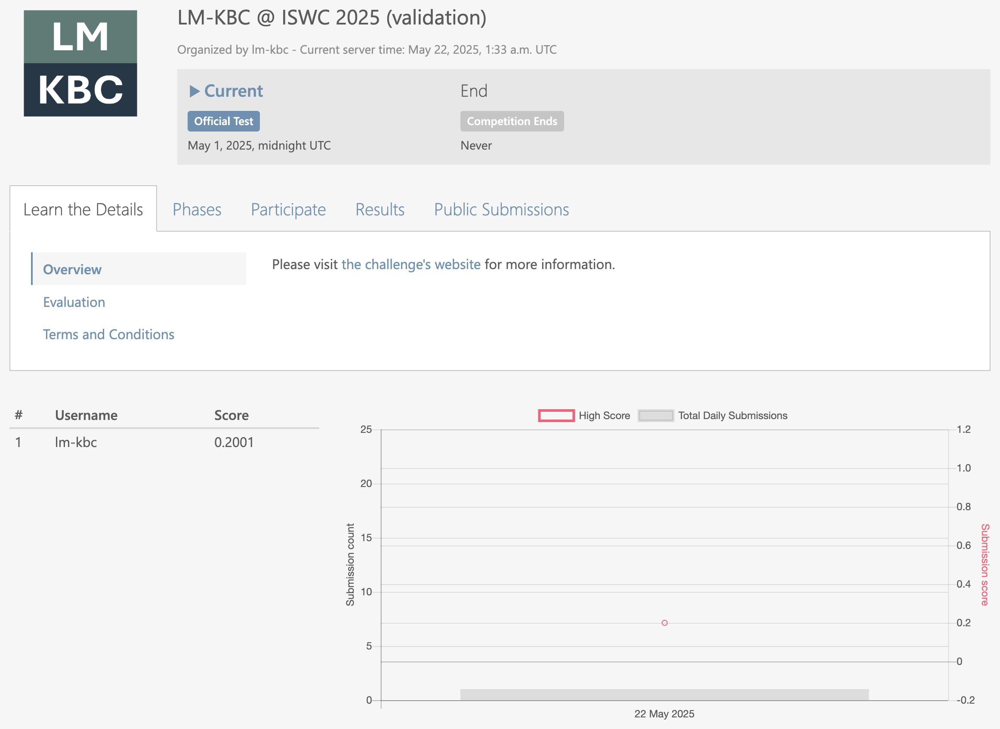

# LM-KBC: Knowledge Base Construction from Pre-trained Language Models (4th Edition)

This repository hosts data for the LM-KBC challenge at ISWC
2025 (https://lm-kbc.github.io/challenge2025/).

This repository contains:

- The dataset for the challenge
- Evaluation script
- Baselines
- Instructions for submitting your predictions

## Table of contents

1. [News](#news)
2. [Challenge overview](#challenge-overview)
3. [Dataset](#dataset)
4. [Evaluation metrics](#evaluation-metrics)
5. [Getting started](#getting-started)
    - [Setup](#setup)
    - [Baselines](#baselines)
        - [Baseline: Qwen3-8B](#baseline-qwen3-8b)
    - [How to structure your prediction file](#how-to-structure-your-prediction-file)
    - [Submit your predictions to CodaLab](#submit-your-predictions-to-codalab)

## News

- 01.05.2025: Release of dataset

## Challenge overview

Pretrained language models (LMs) like ChatGPT have advanced a range of semantic
tasks and have also shown promise for
knowledge extraction from the models itself. Although several works have
explored this ability in a setting called
probing or prompting, the viability of knowledge base construction from LMs
remains under-explored. In the 3rd edition
of this challenge, we invite participants to build actual disambiguated
knowledge bases from LMs, for given subjects and
relations. In crucial difference to existing probing benchmarks like
LAMA ([Petroni et al., 2019](https://arxiv.org/pdf/1909.01066.pdf)), we make no
simplifying assumptions on relation
cardinalities, i.e., a subject-entity can stand in relation with zero, one, or
many object-entities. 

Unlike earlier editions, this version does **not require entity disambiguation**. Instead, we
evaluate the predicted object strings directly using string match metrics.

> Formally, given the input subject-entity (s) and relation (r), the task is to
> predict all the correct
> object-entities ({o<sub>1</sub>, o<sub>2</sub>, ..., o<sub>k</sub>}) using LM
> probing.

## Dataset

Number of unique subject-entities in the data splits.

<table>
<thead>
    <tr>
        <th>Relation</th>
        <th>Train</th>
        <th>Val</th>
        <th>Test</th>
        <th>Special features</th>
    </tr>
</thead>
<tbody>
    <tr>
        <td>countryLandBordersCountry</td>
        <td>68</td>
        <td>68</td>
        <td>67</td>
        <td>Null values possible</td>
    </tr>
    <tr>
        <td>personHasCityOfDeath</td>
        <td>100</td>
        <td>100</td>
        <td>100</td>
        <td>Null values possible</td>
    </tr>
    <tr>
        <td>hasCapacity</td>
        <td>100</td>
        <td>100</td>
        <td>100</td>
        <td>Object is numeric</td>
    </tr>
    <tr>
        <td>awardWonBy</td>
        <td>10</td>
        <td>10</td>
        <td>10</td>
        <td>Many objects per subject</td>
    </tr>
    <tr>
        <td>companyTradesAtStockExchange</td>
        <td>100</td>
        <td>100</td>
        <td>100</td>
        <td>Null values possible</td>
    </tr>
        <tr>
        <td>hasArea</td>
        <td>100</td>
        <td>100</td>
        <td>100</td>
        <td>Object is numeric (square km)</td>
    </tr>
</tbody>
</table>

## Evaluation metrics

We evaluate the predictions using macro precision, recall, and F1-score.
See the evaluation script ([evaluate.py](evaluate.py)) for more details.

```bash
python evaluate.py \
  -g data/val.jsonl \
  -p data/testrun-XYZ.jsonl
```

Parameters: ``-g`` (the ground truth file), ``-p`` (the prediction file).

## Getting started

### Setup

1. Clone this repository:

    ```bash
    mkdir lm-kbc-2025
    cd lm-kbc-2025
    git clone https://github.com/lm-kbc/dataset2025.git
    cd dataset2025
    ```

2. Create a virtual environment and install the requirements:

    ```bash
    conda create -n lm-kbc-2025 python=3.11
    ```

    ```bash
    conda activate lm-kbc-2025
    pip install -r requirements.txt
    ```

3. Write your own solution and generate predictions (format described
   in [How to structure your prediction file](#how-to-structure-your-prediction-file)).
4. Evaluate your predictions using the evaluation script
   (see [Evaluation metrics](#evaluation-metrics)).
5. Submit your solutions to the organizers
   (see [Call for Participants](https://lm-kbc.github.io/challenge2025/#call-for-participants)),
   and/or submit your predictions to CodaLab
   (see [Submit your predictions to CodaLab](#submit-your-predictions-to-codalab)).

### Baselines

We provide baselines using Qwen3-8B model ([models/baseline_qwen_3_model.py](models/baseline_qwen_3_model.py)),

You can run these baselines via the [baseline.py](baseline.py) script and
providing it with the corresponding configuration file. We provide example
configuration files for the baselines in the [configs](configs) directory.

#### Baseline: Qwen3-8B

Config
file: [configs/baseline-qwen-3.yaml](configs/baseline-qwen-3.yaml)

```bash
python baseline.py -c configs/baseline-qwen-3.yaml -i data/val.jsonl
python evaluate.py -g data/val.jsonl -p output/baseline-qwen-3.jsonl
```

Results (without entity disambiguation):

```text
                              macro-p  macro-r  macro-f1  micro-p  micro-r  micro-f1  avg. #preds  #empty preds
awardWonBy                      0.173    0.027     0.043    0.173    0.021     0.038       18.500             0
companyTradesAtStockExchange    0.230    0.561     0.215    0.248    0.329     0.283        1.050             0
countryLandBordersCountry       0.653    0.873     0.628    0.787    0.782     0.784        2.618             0
hasArea                         0.180    0.180     0.180    0.180    0.180     0.180        1.000             0
hasCapacity                     0.030    0.030     0.030    0.030    0.030     0.030        1.000             0
personHasCityOfDeath            0.100    0.550     0.100    0.100    0.179     0.128        1.000             0
*** All Relations ***           0.209    0.401     0.200    0.298    0.114     0.165        1.607             0
```

Results (with entity disambiguation):

```text
                              macro-p  macro-r  macro-f1  micro-p  micro-r  micro-f1  avg. #preds  #empty preds
awardWonBy                      0.512    0.032     0.050    0.205    0.024     0.044       17.600             3
companyTradesAtStockExchange    0.800    0.601     0.515    0.596    0.392     0.473        0.520            53
countryLandBordersCountry       0.891    0.877     0.852    0.870    0.788     0.827        2.382            16
hasArea                         0.180    0.180     0.180    0.180    0.180     0.180        1.000             0
hasCapacity                     0.030    0.030     0.030    0.030    0.030     0.030        1.000             0
personHasCityOfDeath            0.590    0.550     0.390    0.196    0.182     0.189        0.510            49
*** All Relations ***           0.472    0.410     0.356    0.373    0.120     0.182        1.341           121
```

### How to structure your prediction file

Your prediction file should be in the jsonl format.
Each line of a valid prediction file contains a JSON object which must
contain at least 3 fields to be used by the evaluation script:

- ``SubjectEntity``: the subject entity (string)
- ``Relation``: the relation (string)
- ``ObjectEntities``: the predicted object entity strings
- ``ObjectEntitiesID``: the predicted object entity IDs, which should be a list
  of Wikidata IDs (strings).

This is an example of how to write a prediction file:

```python
import json

# Dummy predictions
predictions = [
    {
        "SubjectEntity": "Dominican republic",
        "Relation": "CountryBordersWithCountry",
        "ObjectEntities": ["Haiti", "Venezuela", "United States", "Germany"],
        "ObjectEntitiesID": ["Q790", "Q717", "Q30", "Q183"]
    },
    {
        "SubjectEntity": "Jiaxing Stadium in Jiaxing",
        "Relation": "hasCapacity",
        "ObjectEntities": ["35000"],
        "ObjectEntitiesID": ["35000"]
    },
    {
        "SubjectEntity": "Mauritius",
        "Relation": "CountryBordersWithCountry",
        "ObjectEntities": [],
        "ObjectEntitiesID": []
    }

]

fp = "./path/to/your/prediction/file.jsonl"

with open(fp, "w") as f:
    for pred in predictions:
        f.write(json.dumps(pred) + "\n")
```

### Submit your predictions to CodaLab

Links to the CodaLab competition leaderboard (validation): https://codalab.lisn.upsaclay.fr/competitions/22964

We will release the test leaderboard with the test dataset.

To participate in the competition and join the leaderboard, sign up for your team account at [CodaLab](https://codalab.lisn.upsaclay.fr/competitions/22964).
Then register for the competition and submit your predictions at Participate -> Submit / View Results.

The baseline result of the Qwen3-8B model is shown on the leaderboard under the name `lm-kbc`:
